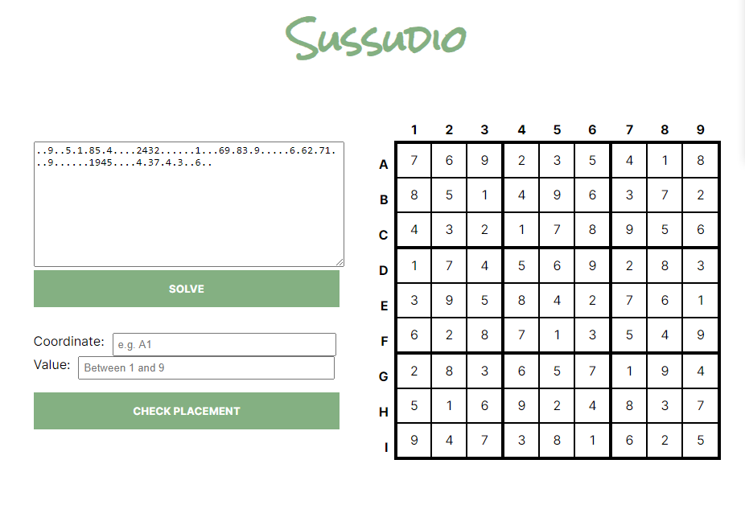

# Sussudio

Sussudio is a bare bones sudoku solver. Built as part of the [FreeCodeCamp](https://www.freecodecamp.org) challenges.

A working demonstration is hosted [here at repl.it](https://sussudio.sossage.repl.co).

Sussudio accepts incomplete sudoku puzzles with `.` characters in place of unknown digits. You can either test the validity of a character at a coordinate, or ask Sussudio to solve the puzzle completely.
